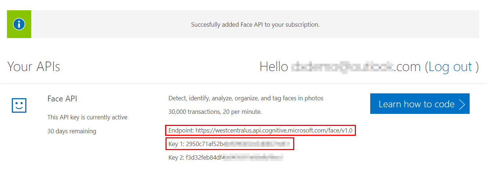
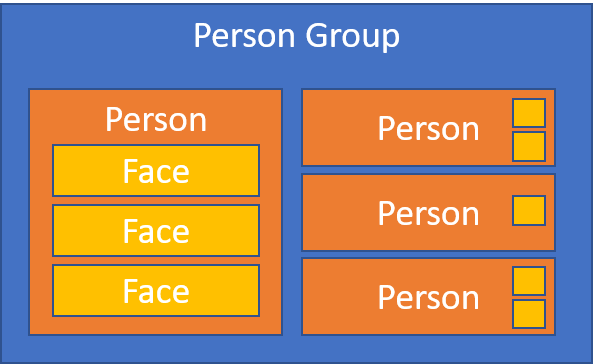

# Part 1 - Identify a Customer

In the first exercise, we're going to use the [Cognitive Services Face API](https://azure.microsoft.com/en-us/services/cognitive-services/face/) to identify the person who is standing in front of the camera. Practical application of this could be in a retail store when the shopping assistant would get a notification about particular customer and could offer them someting special.

## Final state

At the end of this part, we'll have web frontend calling ASP.NET Core API which will response with name of the person who is on a picture.


## Get a key

Face recognition will be enabled by the Face API and like with any other cloud API, you have to obtain a key which will allow you to call it. 

- If you already have an *Azure Subscription*, you can add a new resource from the Cognitive Services family and select **Face API**.
- If not, there's a free tier you can try without registering for Azure.

### Free tier

1. Go to https://azure.microsoft.com/en-us/services/cognitive-services/ and click **Try Cognitive Service for free**.

   

2. In the **Select your API** section pick **Face API** by clicking the **Get API Key** button.

   

3. Agree to the terms.

   

4. If not signed-in already, login with your account of choice.

   

5. And finally get your key.

   

**Copy** the **Endpoint** and **Key 1** and store them somewhere you will find them later.

Note that you have 30 days to use this free key.

## Prepare front-end

Create a folder on your hard drive for this workshop and clone this repo into it:

```
git clone https://github.com/msimecek/Image-Recognition-HoL.git
```

> In this repo you will find an empty folder called **\_Work**. As its name suggests it's purpose is to host files you create as part of this workshop. But if you prefer to keep your source code somewhere else, no problem at all.

Go to **\_Source** folder and copy **FaceFrontend** to **_Work**.

If you open the front-end page now, it will attempt to initialize your camera a start a video feed. Depending on your browser this may not work - either the browser doesn't support HTML5 camera access (then use another one), or the browser doesn't allow `file:///` to access the camera. These commands will run local HTTP server in a directory of your choice:

```
npm install http-server -g
cd <folder with front-end page>
http-server
```

We're using the [http-server library](https://www.npmjs.com/package/http-server) to quickly host static web files on localhost.


Now visit http://localhost:8080 with your web browser.


## Face API

Let's take a little break now, before we start building our API, to understand the process of people identification.

First you have to teach the model which people you want to recognize.

1. Create a person group.
2. Add new person to this group.
3. Add faces to this person.
4. Train the group.



Then you can send new faces and ask "who is this?"

1. Send an image to the Detect API.
2. If face detected, send it to the Identify API.
3. Profit...


Translated to the language of REST:

* `/api/group`
* `/api/group/[id]/person`
* `/api/group/[id]/person/[id]/faces`
* `/api/group/[id]/train`
* `/api/group/[id]/identify`

## Create backend

Let's implement the API described above!

1. Using the **console** (CMD, Bash, Terminal...) navigate to the **\_Work** folder.
2. Run `dotnet new` and see what options are available.
3. Run `dotnet new webapi -n OSAPI`
4. `cd OSAPI`
5. Run Visual Studio Code: `code .` (including the dot).

> **Note**: You can use the same source code with Visual Studio 2017 as well. Just the specific steps will be different in Visual Studio Code.

Visual Studio Code will ask if you want to add required assets. Click **Yes**, becuase it will allow you to build and debug directly from VS Code.


The project structure is quite simple.

* **Program.cs** is where the app is started. It's basically a Console application, but we're telling it to use WebHost (therefore making it a web application).
* **Startup.cs** is where the app is initialized. You specify "middlewares" (such as MVC) through which will every request go.
* **Controllers/ValuesController.cs** is a sample API controller that demonstrates how to respond to REST requests. We will ignore it completely.
* We will also ignore .vscode, bin and obj folders.
* **wwwroot** is where any static content would go (such as HTML, CSS and JS files). Since we're building an API, we won't need it.

> ASP.NET WebAPI follows the Model-View-Controller (MVC) pattern and uses Dependency Injection (DI).

We are going to build our API as a new controller.

1. Right click the **Controllers** folder and select **New File**.
2. Call it **PersonController.cs**.
3. Add basic .NET scaffolding:

```c#
using Microsoft.AspNetCore.Mvc;

namespace OSAPI
{
    public class PersonController : Controller
    {
        
    }
}
```

## APIs for new faces

Install the **Face API NuGet package** for .NET Core by running this command in the **OSAPI** folder:

```
dotnet add package Microsoft.ProjectOxford.Face.DotNetCore
```

Go back to VS Code and open the **PersonController.cs** file.

Add two constants with information you copied at the beginning (Face API *Key 1* & *Endpoint*) into the **PersonController** class:

```c#
public class PersonController : Controller
{
   private const string _faceApiKey = "b66aaaacccccasaa8888887ae88b38";
   private const string _faceApiEndpoint = "https://westeurope.api.cognitive.microsoft.com/face/v1.0";
   ...
```

Under these constants add new method to the **PersonController** class which will create a new Person Group with ID of your choice:

```c#
...
  
[Route("api/group")]
[HttpPost]
public async Task<ActionResult> CreateGroup([FromBody]string groupId)
{
    var client = new FaceServiceClient(_faceApiKey, _faceApiEndpoint);
    try
    {
        await client.CreatePersonGroupAsync(groupId, groupId);
        return Created($"/api/group/{groupId}", groupId);
    }
    catch (FaceAPIException ex)
    {
        return BadRequest(ex.ErrorMessage);
    }
}
```

> **TIP**: If your code doesn't look very well after copy-pasting, press **Alt + Shift + F**. It will reformat itself.

If you're new to .NET you may be worried by the red squiggly lines under parts of this code. This means that there is a syntax error, in this case missing reference to libraries. The fix is very easy: place cursor to an underlined word, press `Ctrl + .` and select *using ...*.


This will add the required using statement to the top of the file. Repeat this for any other red lines. If the *using* doesn't show up it's probably because of a syntax error.

> **FaceServiceClient** might not work with this approach. If you don't see the using offered in menu, restart Visual Studio.

Let's test our API now. 

1. Press **F5** to build and run it in Visual Studio Code. (If it fails for the first time, try again.)

2. Run **Postman**.

3. Issue a **POST** request to `http://localhost:5000/api/group` with **Body** of `"customers"` and type **raw** + `application/json`.

   

4. The API should return status *201 Created* and body of "*customers*".

5. Try to POST a name which is not allowed by the API. Such as "*our customers*".

6. The API should return status *400 Bad Request* with an error message.

Next step is to create a person in a group. Let's add another method to the **PersonController** class, just under the previous one:

```c#
[Route("api/group/{groupId}/person")]
[HttpPost]
public async Task<ActionResult> CreatePerson([FromBody]string name, string groupId)
{
    var client = new FaceServiceClient(_faceApiKey, _faceApiEndpoint);
    try
    {
        CreatePersonResult result = await client.CreatePersonAsync(groupId, name);
        return Created(result.PersonId.ToString(), result.PersonId);
    }
    catch (FaceAPIException ex)
    {
        return BadRequest(ex.ErrorMessage);
    }
}
```

> CreatePersonResult comes from a different namespace so you'll see the red squiggly again. By now you should know how to resolve it ;)

CreatePerson expects group ID in the URL and person's name in body.

1. Press **F5** and run the API again.
2. In **Postman** send a new POST request to `http://localhost:5000/api/group/customers/person` with body of type **application/json** and content of your name (e.g. `"Martin"` - including quotes).
3. The API should return status *201 Created* and new person's ID in the body. **Copy this GUID and store it somewhere.**

The last step before training is to add person's faces to the collection. For that we'll create yet another method in our API.

```c#
[Route("api/group/{groupId}/person/{personId}/faces")]
[HttpPost]
public async Task<ActionResult> AddPersonFace([FromBody]string imageFile, string groupId, string personId)
{
    var client = new FaceServiceClient(_faceApiKey, _faceApiEndpoint);

    Stream image = Images.DecodeBase64Image(imageFile);
    try
    {
        var addFaceResult = await client.AddPersonFaceAsync(groupId, Guid.Parse(personId), image);
        return Created(addFaceResult.PersistedFaceId.ToString(), addFaceResult.PersistedFaceId);
    }
    catch (FaceAPIException ex)
    {
        return BadRequest(ex.ErrorMessage);
    }
}
```

There's one red error we cannot resolve just by adding using to some library. The `Images` class does not exist yet and we will create it now.

1. In Visual Studio Code create new folder in the project, call it **Utils**.
2. Add new file to it, call it **Images.cs**.
3. Code its content:

```c#
using System.IO;
using System.Text.RegularExpressions;

namespace OSAPI.Utils
{
    public static class Images
    {
        public static Stream DecodeBase64Image(string base64Image)
        {
            var base64Data = Regex.Match(base64Image, @"data:image/(?<type>.+?),(?<data>.+)").Groups["data"].Value;
            byte[] data = System.Convert.FromBase64String(base64Data);
            MemoryStream ms = new MemoryStream(data);

            return ms;
        }
    }
}
```

We will use the only static method to decode a photo from Base64 format (used by our web frontend) to Stream (used by the Face API).

You should be able to resolve the red squiggle in PersonController now.

Then finally add the training method to **PersonController** class.

```c#
[Route("api/group/{groupId}/train")]
[HttpPost]
public async Task<ActionResult> TrainGroup(string groupId)
{
    using (var client = new FaceServiceClient(_faceApiKey, _faceApiEndpoint))
    {
        await client.TrainPersonGroupAsync(groupId);
    }

    return Ok();
}
```

And finally - run with **F5** and call it from **Postman**.

`POST http://localhost:5000/api/group/customers/train`

## APIs for identification

With our person in place, faces added and group trained we can finally start identifying. There are three steps in this process:

1. Send the image file to Detect Faces API.
2. Send the detected faces to Identify Person API.
3. Get person details based on identification.

At the end, we're interested in the person's name, so that we can display it.

Still in the **PersonController**, add this method under the TrainGroup method:

```c#
[Route("api/group/{groupId}/identify")]
[HttpPost]
public async Task<ActionResult> Identify([FromBody]string imageFile, string groupId)
{
    var client = new FaceServiceClient(_faceApiKey, _faceApiEndpoint);

    Stream image = Images.DecodeBase64Image(imageFile);
    Face[] detectResult = await client.DetectAsync(image);
    if (detectResult.Length > 0)
    {
        Face firstFace = detectResult[0];
        IdentifyResult[] identResult = await client.IdentifyAsync(groupId, new Guid[] { firstFace.FaceId });
        Guid? topResultId = identResult.FirstOrDefault().Candidates.FirstOrDefault()?.PersonId;
        if (topResultId != null)
        {
            var person = await client.GetPersonAsync(groupId, topResultId.Value);
            return Ok(person.Name);
        }
        else
        {
            return Ok("Unknown person...");
        }
    }
    else
    {
        return NotFound("No faces found on the image.");
    }
}
```

All done for now. Let's test it all together!

## Testing the app

1. Using the console, navigate to **FaceFrontend** folder and start local server: `http-server`.
2. Press **F5** in Visual Studio Code to run the API.
3. In your web browser navigate to http://localhost:8080 .
4. Enter the name of your person group to the first field.
5. Enter the person ID to the second field.
6. Click **Add face**.
7. And nothing happens...

In the current setup our frontend site is not allowed to communicate with backend API because of the [Cross-Origin Resource Sharing](https://developer.mozilla.org/en-US/docs/Web/HTTP/Access_control_CORS) (aka **CORS**). Even though both our resources run at localhost, their ports are different - and therefore cross-origin. We need to set our API in a way that it allows requests from any origin.

1. Go to **Startup.cs**.

2. Find the **ConfigureServices** method and add `services.AddCors();` to it:

   ```c#
   public void ConfigureServices(IServiceCollection services)
   {
       services.AddCors();
       services.AddMvc();
   }
   ```

3. Find the **Configure** method and add this to it:

   ```
   public void Configure(IApplicationBuilder app, IHostingEnvironment env)
   {
       if (env.IsDevelopment())
       {
           app.UseDeveloperExceptionPage();
       }

       app.UseCors(options => options
           .AllowAnyOrigin()
           .AllowAnyMethod()
           .AllowAnyHeader()
           .AllowCredentials());

       app.UseMvc();
   }
   ```

4. Run the API again (**F5**).

5. Try to add a face again.

## Identifying a person

You try the face identification now, but remember to call the `/api/group/customers/train` endpoint every time after you add new faces!

